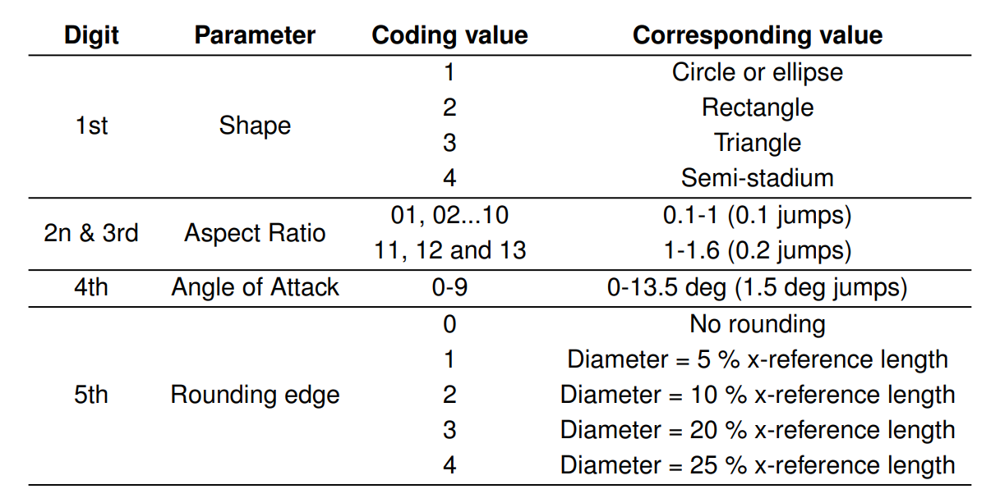

# bluffFOAM

CFD simulation pipeline using the `OpenFOAM` framework to generate a 2D 
database for machine learning purposes using bluff body shapes generated through a self-made 5-digits coding system:



The pipeline can generate results of subsonic incompressible simulations for Mach numbers 
`M < 0.3`.

The detailed explanation about the simulation pipeline as well as the 
performed verification and validation can be found here (LINK TO PAPER).

To reference this algorithm, please cite the repository as:
```
@misc{pay2023bluffFOAM,
  title={Aerodynamic Database Automation for 2D Bluff Bodies for Deep Learning  with Convolution Neural Networks},
  author={Widmann, Sebastian and Schlichter, Philipp and Indinger, Thomas},
  year={2023},
  publisher={GitHub},
  howpublished={\url{https://github.com/AlvaroPay/bluffFOAM}},
}
```

## 1. AirfoilMNIST: A Large-Scale Dataset based on Two-Dimensional RANS Simulations of Airfoils

The subsets of the *airfoilMNIST* datasets are subsequently linked here once the data has been published.
* airfoilMNIST-raw: https://web.tresorit.com/l/caxBx#uO5w7Q1BS6g1SvDAsrdyVA (currently a snippet (10% of the total dataset), containing all airfoils and angles of attack for Mach = 0.2 - more will be added asap)
* airfoilMNIST: Not uploaded yet
* airfoilMNIST-incompressible: https://syncandshare.lrz.de/getlink/fiHGg7CzJ1tajtpDxwR65D/

## 2. Running the bluffFOAM pipeline

### 2.1 Dependencies

* OpenFOAM v2206 or newer
* Python packages as set in *requirements.txt*

### 2.2 Set OpenFOAM environment

* To execute the main script `bluffFOAM.py`, one has to enter the OpenFOAM 
  environment or source toward the bashrc script
    * **Ubuntu**: `source /lib/openfoam/openfoam2206/etc/bashrc`

### 2.3 Set Python environment on HPC systems
* Typically, Python is installed in the `usr/bin/python3.XX` directory on 
  local Linux machines. However, this is often not true for HPC systems.
  * By default, `bluffFOAM.py` will look for the executable of Python in the 
    following directory -> `usr/bin/python3`
  * If a virtual environment is used, the directory to the Python executable 
    must be specified in the `shebang line` at the beginning of `bluffFOAM.py`
    
* The simulations will be saved into the `database` directory which will be 
  generated once the main script is executed.
  To minimise the storage capacity, it is advised to delete the raw data 
  folders and only keep the `VTK` files in the
  database folder.

### 2.4 Run multiple simulations

* Specify range of Mach numbers as `list` or `array` in line 314
    *     mach = np.arange(0.05, 0.65, 0.05)
* Specify range of bluff geometries through function `generateBluff()` decommenting line 315 and commenting 316
        * In the function the different digits can be modified
    *     shape = np.arange(1,5,1)
    *     aspect_ratio = np.arange(1,18,1)
    *     angle = np.arange(0,11,1)
    *     edge = np.arange(0,5,1)
* Execute `bluffFOAM.py` script

### 2.6 Run single simulation

* Specify the bluff code that wants to be run in line 316:
    * bluffs = ['10400']
* Specify the mach number in line 314:
    * machs = np.array([0.1])   
* Execute `bluffFOAM.py` script

### 2.7 Postprocessing

* To generate the textfile with the lift, drag and moment coefficients for 
  all simulations, simply execute the `postProcessing.py` script after the 
  `nacaFOAM.py` script has been executed sucessfully. This script will generate
  a new `.csv` file within the `database` directory.


